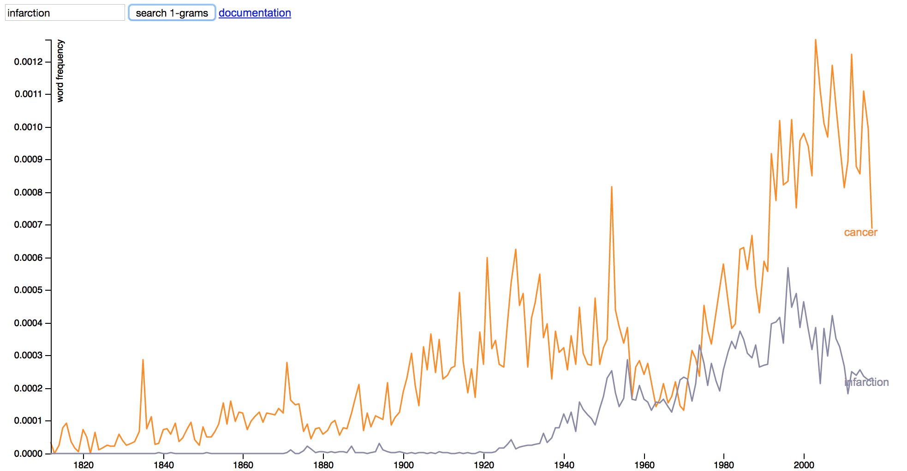

# NEJM ngrams

This project provides a fresh dataset to the field of culturomics from a unique source: The New England Journal of Medicine. By tracking word and phrase usage across time in a high-profile, edited, biomedical journal we can infer a lot about the history of medical language and culture. A manuscript describing the project in more detail is forthcoming.

## What's here

A. Online tool to visualize 1-gram (word) frequencies over time: nejmngrams.github.io. Using this tool you can plot multiple 1-grams on the same axes, just input new words into the text box and hit search.



B. Code for 1. generating links to all pdfs of the NEJM articles from 1812 to 2017 and downloading these files 2. convert pdfs to txt files using either pdfminer or tesseract 3. compiling text into n-grams

C. Raw data for individual 1-grams that appear over 100 times total throughout the entire archive that are comprised of alphanumeric characters or dashes.

## FAQ

### How can I download the raw data?

The raw data for any individual 1-gram can be found in the ngramcsv folder above under its own name. For example, the 1-gram frequencies for "influenza" are found under "influenza.csv" Capital letters are converted to the letter followed by an underscore for webfile disambiguation, for example "Influenza" is filed under "i_nfluenza.csv" More specifically the full path is:

```
https://github.com/nejmngrams/nejmngrams.github.io/ngramcsv/i_nfluenza.csv
```

### When/where will longer n-grams be available?

Raw data for 2-grams will be made available shortly pending space availability. If you have a project requiring higher order n-grams and would like to collaborate feel free to reach out. All the code to create your own n-gram dataset is also available in this repo. Because 3-grams and higher are very sparse owing to the relatively small size of the text corpus, it may actually be more space efficient for you to download the NEJM archives than the n-gram frequencies.

### Why is my 1-gram not showing up?

Only 1-grams that appear over 100 times throughout the entire dataset are included for quality/size reasons. For similar reasons only 1-grams comprised of alphanumeric characters or dashes are included as well. If you are interested in lower-frequency n-grams feel free to reach out. Also note that in the online plotting tool if you are trying to plot two different 1-grams that have vastly different scales, they might not be able to be plotted together on the same graph.

### How do I cite this tool?

A manuscript describing the project in more detail is forthcoming. In the meantime feel free to cite nejmngrams.github.io. Author: Justin Jee
